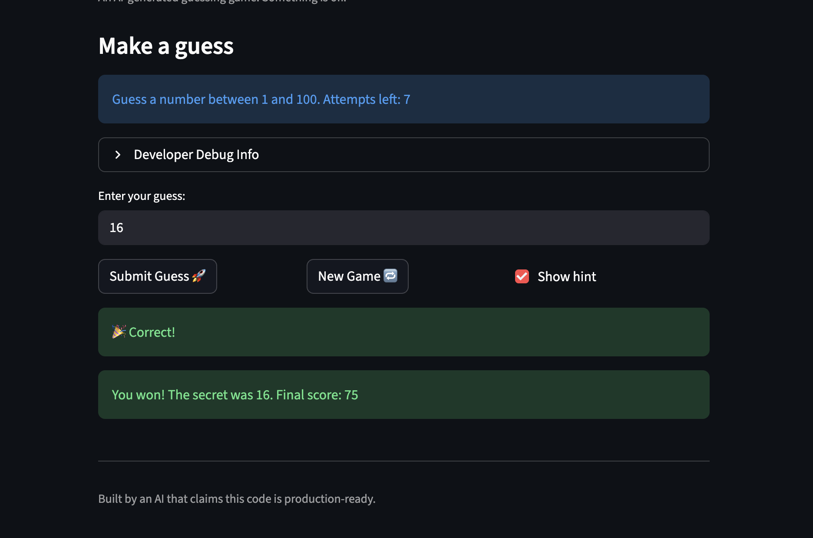
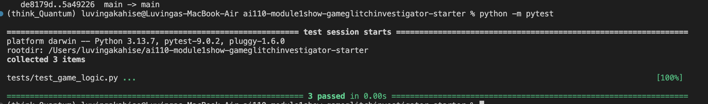

# 🎮 Game Glitch Investigator: The Impossible Guesser

## 🚨 The Situation

You asked an AI to build a simple "Number Guessing Game" using Streamlit.
It wrote the code, ran away, and now the game is unplayable. 

- You can't win.
- The hints lie to you.
- The secret number seems to have commitment issues.

## 🛠️ Setup

1. Install dependencies: `pip install -r requirements.txt`
2. Run the broken app: `python -m streamlit run app.py`

## 🕵️‍♂️ Your Mission

1. **Play the game.** Open the "Developer Debug Info" tab in the app to see the secret number. Try to win.
2. **Find the State Bug.** Why does the secret number change every time you click "Submit"? Ask ChatGPT: *"How do I keep a variable from resetting in Streamlit when I click a button?"*
3. **Fix the Logic.** The hints ("Higher/Lower") are wrong. Fix them.
4. **Refactor & Test.** - Move the logic into `logic_utils.py`.
   - Run `pytest` in your terminal.
   - Keep fixing until all tests pass!

## 📝 Document Your Experience

1. Game Purpose:
The game challenges the player to guess a secret number within a limited number of attempts. Hints indicate whether the guess is too high or too low. The score updates based on attempts and correctness.

2. Bugs Found:
- check_guess() returned a tuple instead of a single outcome, causing test failures
- The secret number changed unexpectedly because it was sometimes converted to a string and Streamlit reruns reset it
- Hints were inconsistent with the actual logic

3. Fixes Applied:
- Modified check_guess() to return only "Win", "Too High", or "Too Low"
- Moved all game state variables (secret number, attempts, score, history) into st.session_state
- Kept the secret number as an integer at all times
- Refactored game logic into logic_utils.py
- Verified fixes manually in Streamlit and with pytest

## 📸 Demo

## 🚀 Stretch Features

- Optional UI improvements, additional scoring tweaks, or custom messages can be documented here with screenshots
